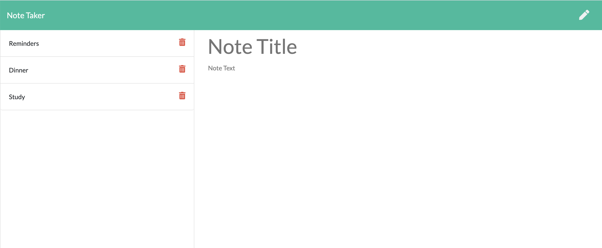

# note-taker
Note Taker Application

Description:

This application is used to write,save and delete user notes. This app uses an express backend to save and retrieve note data from a JSON file.

Usage:

1. The following HTML routes are created:

-    GET /notes - Returns the notes.html file.
 
-    GET * - Returns the index.html file
 
 
 2.  The application has a db.json file on the backend that is used to store and retrieve notes.

3. The following API routes are created:  

- GET /api/notes : Reads the db.json file and return all saved notes as JSON.

- POST /api/notes : Receives a new note to save on the request body, and adds it to the db.json file, and then returns the new note to the client.

- DELETE /api/notes/:id - Receives a query parameter containing the id of a note to delete. In order to delete a note, the ap[plication reads all the notes from the db.json file, removes the note with the given id property, and then rewrites the notes to the db.json file.
 

Technologies:

HTML ,CSS, Node.js, Express JS

Screenshots:

